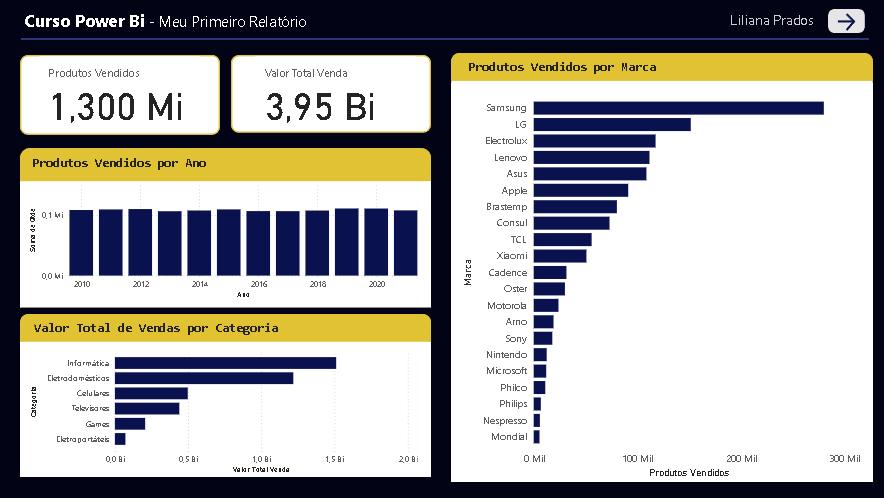
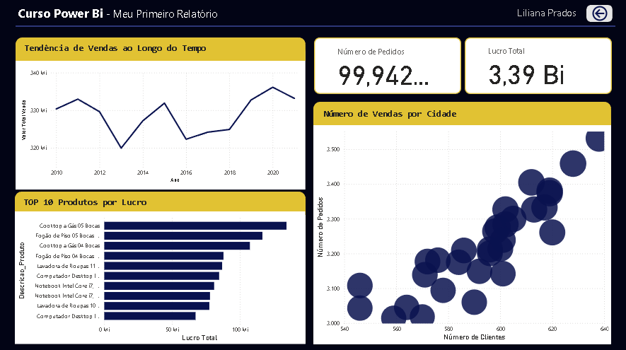

# Curso-DIO-PowerBi
Relatórios desenvolvidos para o curso de Power BI - Bootcamp DIO.

# Desafio de Análise de Vendas - Power BI DIO

## Descrição do Projeto
Este projeto foi desenvolvido como parte do desafio da DIO para demonstrar habilidades em análise de dados utilizando o Power BI. O relatório interativo apresenta insights sobre vendas, permitindo a visualização de tendências e o desempenho de produtos e categorias.

## Dados Utilizados
Os dados para este projeto foram fornecidos em arquivos txt/Excel e incluem informações sobre produtos, categorias e subcatecorias, clientes, vendas, marcas.

## Ferramentas e Tecnologias
* Power BI Desktop

### Página 1

### Página 2

## Como Visualizar o Relatório
Você pode baixar os arquivos em PNG das páginas 1 e 2 do relatório. Ou se preferir algo mais dinâmico, poderá também baixar o arquivo `.pbix`, e abri-lo no Power BI Desktop para explorar o modelo de dados.

## Autor
Liliana Prados
