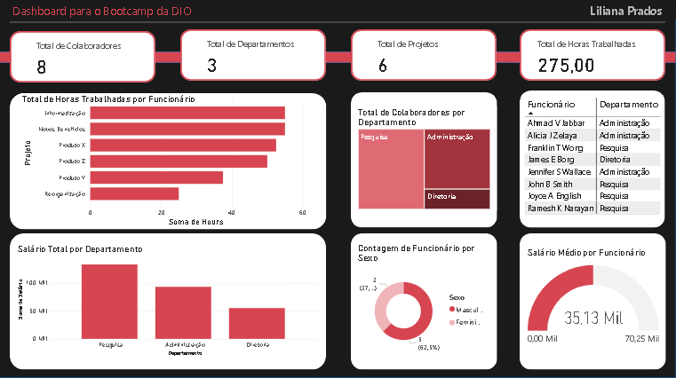

# Curso-DIO-PowerBi
Relatórios e Dashboard desenvolvidos para o curso de Power BI - Bootcamp DIO.

## Ferramentas e Tecnologias
* Power BI Desktop, Excel e MySQL.

# Desafio 1: Análise de Vendas - Power BI DIO

## Descrição do Desafio 1 e Dados Utilizados
Este projeto foi desenvolvido como parte do desafio da DIO para demonstrar habilidades em análise de dados utilizando o Power BI. O relatório interativo apresenta insights sobre vendas, permitindo a visualização de tendências e o desempenho de produtos e categorias. Os dados para este projeto foram fornecidos em arquivos txt/Excel e incluem informações sobre produtos, categorias e subcatecorias, clientes, vendas, marcas.

### Páginas do Relatório
Aqui estão algumas das páginas do relatório para visualização rápida:

#### Página 1

#### Página 2

## Como Visualizar o Relatório
Você pode baixar os arquivos em PNG das páginas 1 e 2 do relatório. Ou se preferir algo mais dinâmico, poderá também baixar o arquivo `.pbix`, e abri-lo no Power BI Desktop para explorar o modelo de dados.

# Desafio 2: Dashboard de Análise de Funcionários e Projetos da Empresa

## Visão Geral do Projeto

Este projeto consiste em um dashboard desenvolvido no **Power BI Desktop**, que oferece uma análise básica dos dados de funcionários, departamentos e projetos de uma empresa. 

## Página do Dashboard

## Como Visualizar/Abrir o Dashboard

Você pode baixar o arquivo em PNG do Dashboard. Ou se preferir algo mais dinâmico, poderá também baixar o arquivo `.pbix`, e abri-lo no Power BI Desktop para explorar o modelo de dados.

## Autor
Liliana Prados
